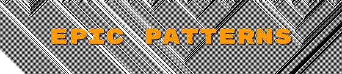

[This page](https://middle-way-approach.github.io/epic-patterns/) creates patterns with a futuristic overlaying planes effect. The patterns can be used as corners, banner or to extract parts of the images for other uses. 
To generate a pattern just hit <button>start</button> until you find a pattern you are happy with and save it using right click.

The algorithm is based off the 2d cellular automata 184.
